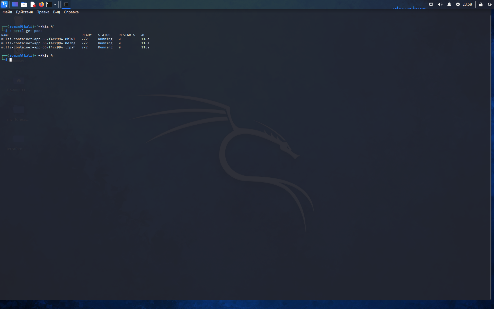
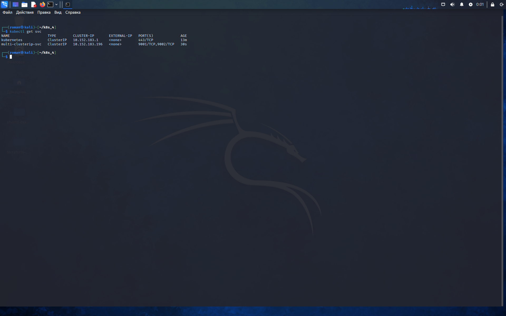
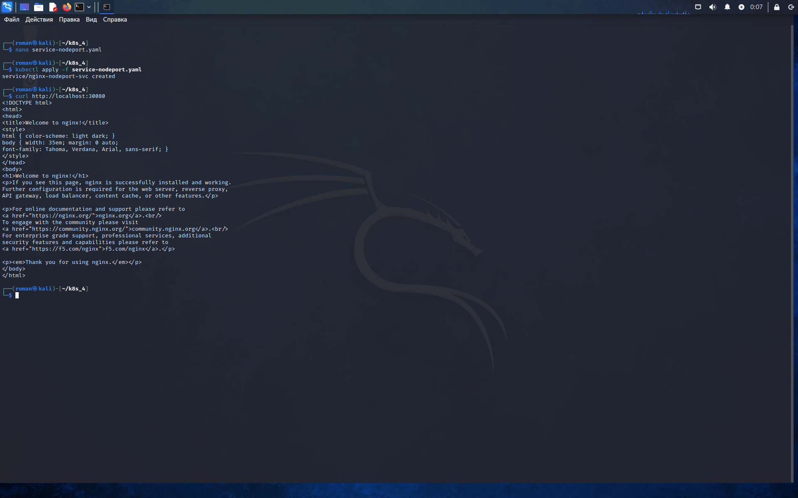
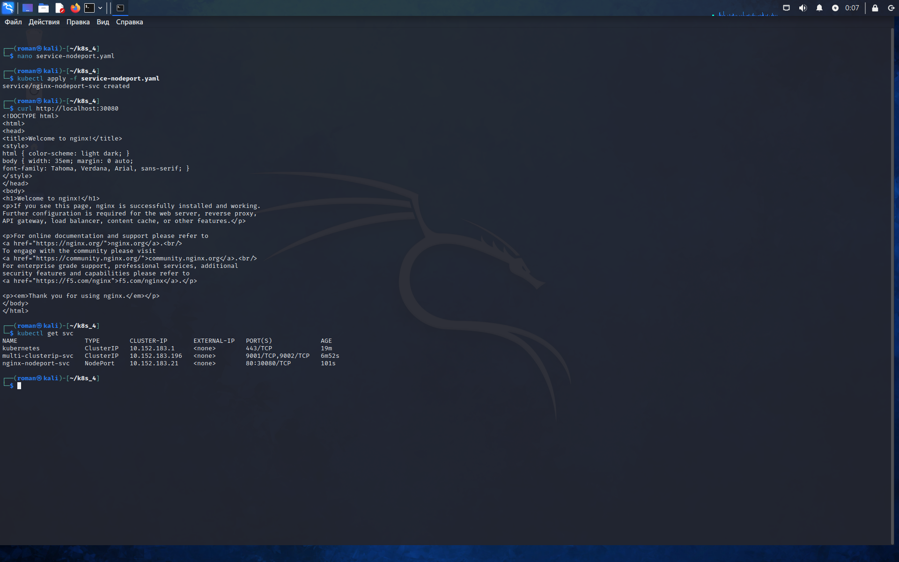
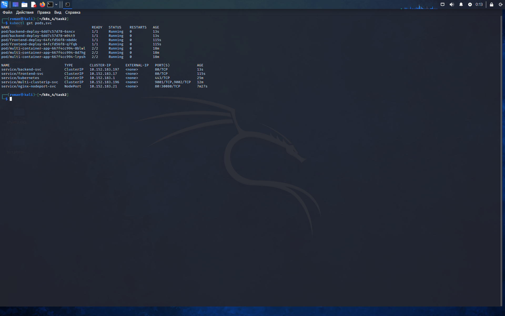
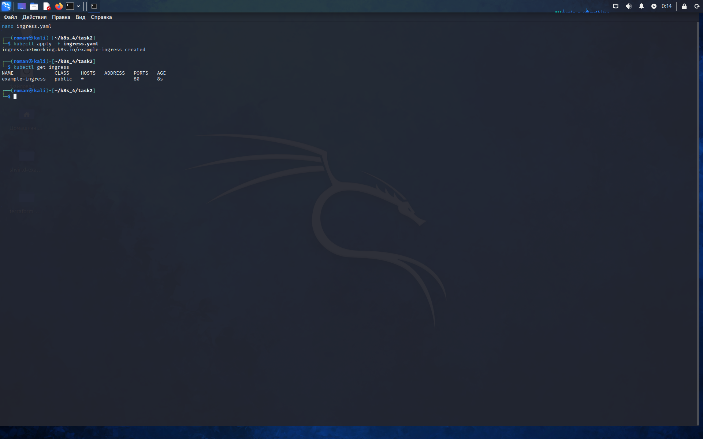
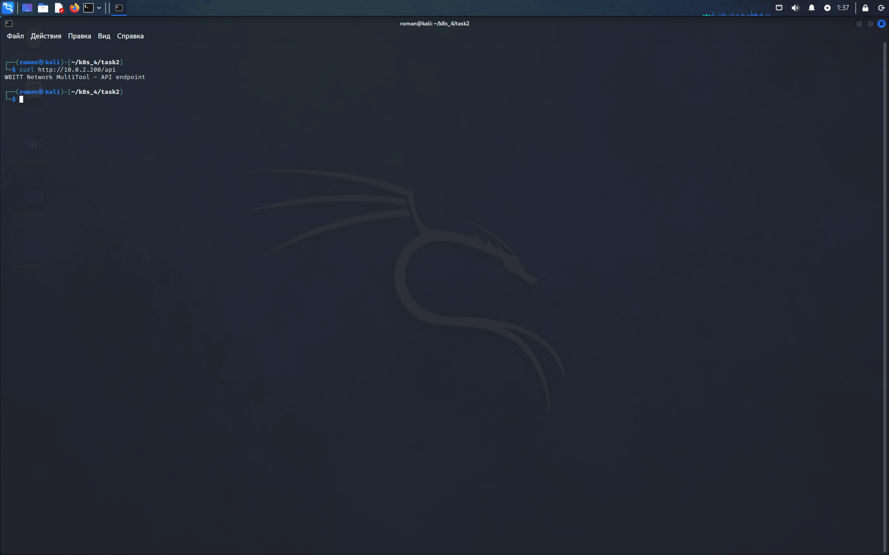
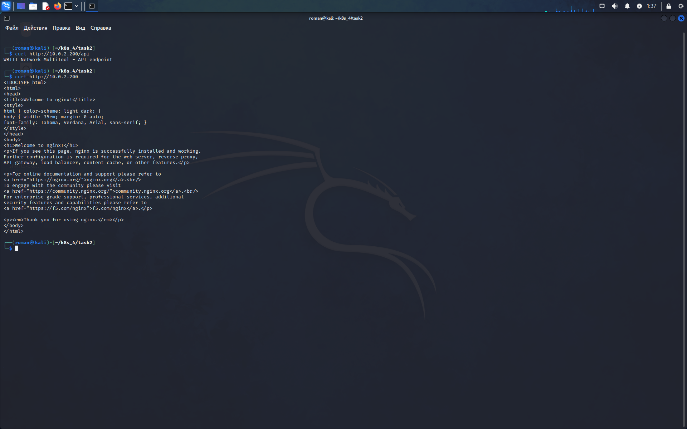

# Домашнее задание: Сетевое взаимодействие в Kubernetes

**Выполнил:** Машаев Роман  
**Дата:** 26.05.2026  

---

## Задание 1. Service (ClusterIP и NodePort)

### Что сделано

1. **Создан Deployment** с двумя контейнерами (`nginx` и `multitool`) и тремя репликами.  
   

2. **Создан Service типа ClusterIP**, открывающий доступ:  
   - порт 9001 → nginx  
   - порт 9002 → multitool  
   

3. **Создан Service типа NodePort** для доступа к nginx снаружи на порту 30080.  
     
   

4. **Проверена доступность** изнутри кластера (сервис работает, NodePort отвечает).

---

## Задание 2. Ingress (маршрутизация по путям)

### Что сделано

1. **Развёрнуты два независимых приложения**:  
   - `frontend` (nginx)  
   - `backend` (multitool)  
   

2. **Включён Ingress Controller** (`microk8s enable ingress`).

3. **Создан Ingress** с правилами:  
   - `/` → frontend  
   - `/api` → backend  
   

4. **Проверен доступ через Ingress** (IP контроллера `10.0.2.200`):  
   - `curl http://10.0.2.200` → страница nginx  
   - `curl http://10.0.2.200/api` → страница multitool  
     
   

---

## Результат

✅ ClusterIP работает внутри кластера  
✅ NodePort даёт доступ к nginx снаружи  
✅ Ingress правильно маршрутизирует трафик по путям `/` и `/api`

**Манифесты** находятся в папках `task1/` и `task2/` репозитория.
